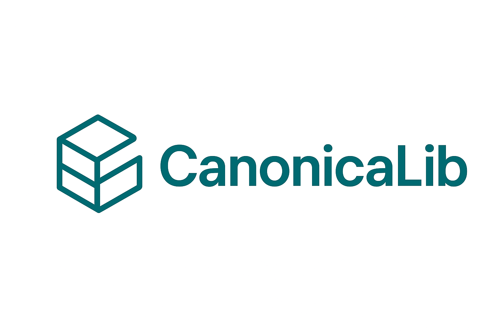

# CanonicaLib

**CanonicaLib** is an open-source library that enables teams to create and maintain canonical shared libraries across multiple projects. It transforms C# source code into standards-compliant packages for different platforms.

## 🎯 Purpose

CanonicaLib bridges gaps between development teams and prevents silos by enabling shared concepts and ideas through canonical models. Define contracts once in C#, generate packages for multiple platforms:

- **Standards-compliant .NET NuGet packages**
- **OpenAPI specifications** 
- **TypeScript NPM packages** *(planned)*

This approach ensures consistent data models, API contracts, and shared capabilities across teams, promoting collaboration and reducing duplication.

## ✨ Features

- **Canonical Model Definitions**: Define data models once using C# classes with attributes
- **OpenAPI Generation**: Automatically generate OpenAPI specs from attributed interfaces
- **Schema Generation**: Convert C# types to JSON schemas using reflection
- **XML Documentation**: Extract descriptions from XML docs automatically
- **Cross-Platform Packages**: Generate packages for multiple platforms from single source

## 🏗️ Architecture

### Core Packages

- **`CanonicaLib.DataAnnotations`** (.NET Standard 2.1): Core attributes for marking canonical contracts
- **`CanonicaLib.UI`** (.NET 8): OpenAPI generation and discovery services

## 🚀 Getting Started

Please see the [Getting Started Guide](./docs/GETTINGSTARTED.md) to get started

## 🤝 Contributing

We welcome contributions! Please see our [Contributing Guidelines](./docs/CONTRIBUTING.md) for details.

## 📄 License

Licensed under the Apache License 2.0 - see [LICENSE](LICENSE) file for details.
**Copyright © 2025 Zen Internet Ltd**

## 📋 Roadmap

- [x] Enhanced schema generation with reflection
- [x] XML documentation integration  
- [x] OpenAPI extensions support
- [ ] TypeScript NPM package generation
- [ ] CLI tooling
- [ ] Enhanced webhook support

## 🏷️ Version History

See [CHANGELOG.md](CHANGELOG.md) for a detailed history of changes and releases.

---

**CanonicaLib** - Building canonical contracts for modern development teams.